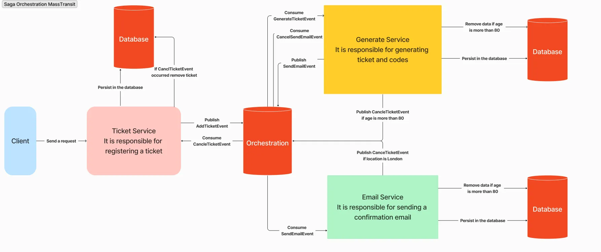

# event-driven-saga-microservices
Saga Orchestration implementation using MassTransit in a microservices architecture with event-driven distributed transactions

# Saga Orchestration with MassTransit (Microservices)

This repository demonstrates a **Saga Orchestration Pattern** implementation in a **microservices architecture** using **MassTransit** for distributed transaction management.

The project showcases how to maintain **data consistency across multiple services** without using distributed locks or two-phase commits.

---

## 🧠 Problem Statement

In a microservices architecture, each service owns its own database.  
Managing transactions that span multiple services becomes challenging.

This project solves that problem using:
- **Saga Pattern (Orchestration-based)**
- **Event-driven communication**
- **Compensating transactions**

---

## 🏗 Architecture Overview



### Main Components

| Service | Responsibility |
|------|---------------|
| **Ticket Service** | Registers tickets and initiates the saga |
| **Orchestration (Saga State Machine)** | Coordinates the workflow and business rules |
| **Generate Service** | Generates ticket codes |
| **Email Service** | Sends confirmation emails |
| **Databases** | Each service owns its own database |

---

## 🔁 Saga Workflow

1. **Client** sends a request to register a ticket.
2. **Ticket Service**
   - Persists ticket data
   - Publishes `AddTicketEvent`
3. **Saga Orchestrator**
   - Consumes `AddTicketEvent`
   - Decides next steps based on business rules
4. **Generate Service**
   - Consumes `GenerateTicketEvent`
   - Generates ticket & codes
   - Publishes `SendEmailEvent`
5. **Email Service**
   - Sends confirmation email
   - Persists email logs

---

## ⚠️ Business Rules & Compensation

The Saga enforces business rules centrally:

- ❌ If **age > 80**
  - `CancelTicketEvent` is published
  - Ticket, generated data, and email records are removed
- ❌ If **location is London**
  - Saga is canceled
  - Compensating actions are triggered

Each service listens to `CancelTicketEvent` and **rolls back its own data**.

---

## 🧩 Saga Pattern Type

- ✅ **Orchestration-based Saga**
- ❌ No direct service-to-service coupling
- ✅ Centralized decision making
- ✅ Easier to monitor and debug

---

## 🛠 Technologies Used

- **.NET**
- **MassTransit**
- **Message Broker (RabbitMQ / In-Memory)**
- **Entity Framework Core**
- **Microservices Architecture**
- **Event-Driven Design**

---

## 🎯 Key Concepts Demonstrated

- Saga Orchestration Pattern
- Distributed transactions
- Compensating transactions
- Event-driven microservices
- Decoupled services
- Data consistency without 2PC

---

## How to clone

1. Clone the repository:
   ```bash
   git clone https://github.com/your-username/saga-orchestration-microservices.git

## 🚀 How to run
   ```bash 
   docker compose up -d  

